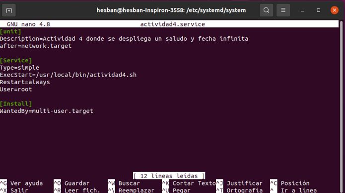

<p> Universidad de San Carlos de Guatemala </p>
<p> Facultad de Ingeniería </p> 
<p> Escuela de Ciencias y Sistemas </p>
<p> Sistemas Operativos 1 </p>
<p> Segundo Semestre 2024 </p>
<p> Catedrático: Jesús Alberto Guzmán Polanco </p>

### Datos Personales:
Nombre                              | Carnet
----------------------------------- | -------------
Hesban Amilcar Argueta Aguilar      | 201704787

## Actividad 4 - Systemd Unit

Crear un systemd unit de tipo servicio que realice lo siguiente:

- Ejecutar un script imprima un saludo y la fecha actual infinitamente con una pausa de un segundo.

### Script

Se puede verificar el script en: [Script](./actividad4.sh)

```bash
#!/bin/bash

while true
do
    echo "Hola hoy es $(date +"%d/%m/%Y") !"
    sleep 1 # Intervalo de un segundo
done
```

### Pasos para ejecutar y habilitar el servicio

### 1. Crear el Script de Bash
Primero se creó el script de bash que imprime el saludo y la fecha actual. Este script se guardo en el directorio `/usr/local/bin` con el nombre de `actividad4.sh`:


al script `actividad4` hay que darle permisos de ejecución:


### 2. Crear la unidad de servicio de systemd
Luego se creó un archivo de servicio en el directorio `/etc/systemd/system/` con el nombre `actividad4.service`:



Ahora podemos observar el servicio creado en la carpeta system:


### 3. Habilitar el servicio

- Después que se creó el archivo en el directorio, se recargó `system` para que se apliquen los cambios:

```bash
sudo systemctl daemon-reload
```

- Se habilita el servicio para que se inicie automáticamente el sistema:

```bash
sudo systemctl enable actividad4.service
```

- Por último se inicia el servicio con el siguietne comando:

```bash
sudo systemctl start actividad4.service
```

### 4. Verificación del estado del servicio

Para verificar que el servicio esta funcionando correctamente se ejecuta la siguiente línea de comando:

```bash
sudo systemctl status actividad4.service
```

Con esto se muestra el estado de servicio y como se puede observar, se ejecuta cada 1 segundo desde la ubicación especificada en `/usr/local/bin/actividad4.sh`:


