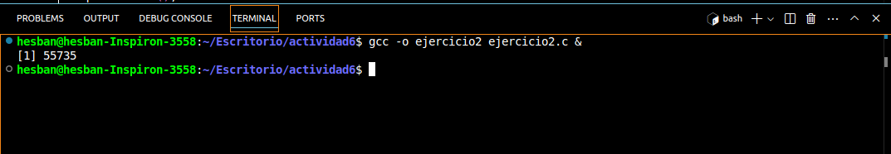
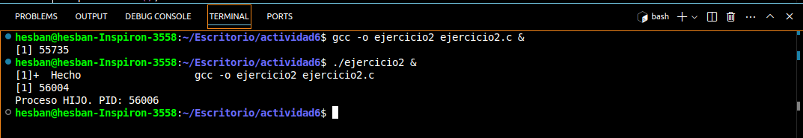
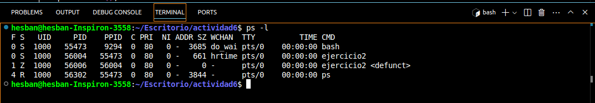
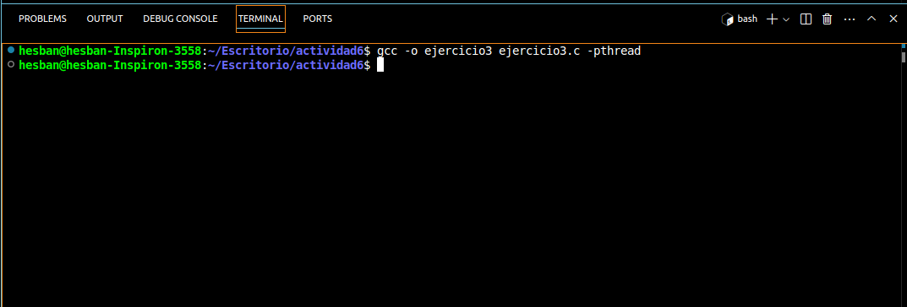
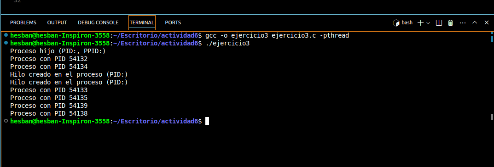
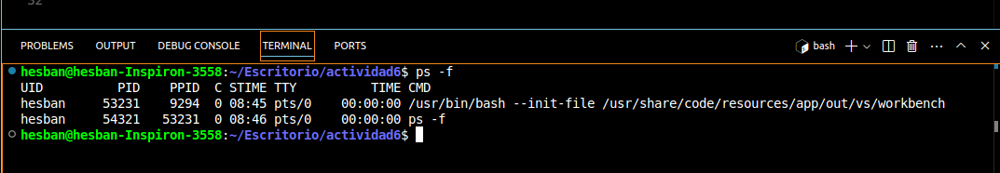

<p> Universidad de San Carlos de Guatemala </p>
<p> Facultad de Ingeniería </p> 
<p> Escuela de Ciencias y Sistemas </p>
<p> Sistemas Operativos 1 </p>
<p> Segundo Semestre 2024 </p>
<p> Catedrático: Jesús Alberto Guzmán Polanco </p>

### Datos Personales:
Nombre                              | Carnet
----------------------------------- | -------------
Hesban Amilcar Argueta Aguilar      | 201704787

### Actividad 6 - Procesos e Hilos

### 1. ¿Incluyendo el proceso inicial, cuantos procesos son creados por el siguiente programa? Razone su respuesta

```bash
#include <stdio.h>
#include <unistd.h>

int main ()
{
    /* fork a child process */
    fork();

    /* fork another child proess */
    fork();

    /* and fork another */
    fork();

    return 0;
}
```

## **Respuesta**

Como podemos observa hay una primera llamada a `fork()`, el cual el proceso original que es el proceso pirncipal o `padre` llama a `fork()`. Se crea un proceso hijo por lo que ahora se tienen dos procesos en ejeución.

Ahora ambos procesos `padre e hijo creados anteriormente` ejecutan la segunda llamada `fork()`, por lo que el proceso padre crea un nuevo hijo y el proceso hijo también crea su propio proceso hijo. Ahora se tienen cuatro procesos en ejecución.

Posteriormente se hace una tercera lamada a `fork()`, teniendo en cuenta que hay cuatro procesos en ejecución generados anteriormente cada proceso genera u proceso hijo. Por lo que al final se tendrán ocho procesos en ejecución que son los cuatro procesos anteriores y cuatro procesos adicionales en la tercer llamada.

Por lo que en total hay **8 procesos**: 7 procesos hijos y 1 que es el original.

### 2. Utilizando un sistema Linux, escriba un programa en C que cree un proceso hijo (fork) que finalmente se convierta en un proceso zombie. Este proceso zombie debe permanecer en el sistema durante al menos 60 segundos. Los estados del proceso se pueden obtener del comando: ps -l
 
Primero se crea el código en lenguaje C que crea lo hilos:

```bash
#include <stdio.h>
#include <stdlib.h>
#include <unistd.h>
#include <sys/types.h>
#include <sys/wait.h>

int main() {
    pid_t pid;
    pid = fork();
    if (pid > 0) {
        sleep(60);
        wait(NULL); 
    } else if (pid == 0) {
        printf("Proceso HIJO. PID: %d\n", getpid());
        exit(0);
    } else {
        printf("Error al crear el proceso\n");
        return 1;
    }
    return 0;
}
```

Luego se abre una terminal y se compila el código con el siguiente comando `gcc -o ejercicio2 ejercicio2.c`: 



Ahora se ejecuta el programa:



Como se puede observar nos manda nos imprime en consola `Proceso HIJO. PID: 56006`. Mientras el proceso padre está espeando, se procede a abrir otra terminal para ejecutar el comando `ps -l`, ahí se observa el proceso hijo en estado `Zombie`, marcado con una `Z`:



El estado `Z` significa que el proceso está en estado zombie (defunct). Después de 60 segundos, e proceso padre recolecta el estado del proceso hijo, elimnando así el zombie.

### 3. Usando el siguiente código como referencia, completar el programa para que sea ejecutable y responder las siguientes preguntas: 
-¿Cuántos procesos únicos son creados? 
-¿Cuántos hilos únicos son creados?

Este es el código proporcionado y el cual se debe de completar:

```bash
pid = fork();
if (pid==0) { /* child process*/
    fork();
    thread_create(...):
}
fork();
```
Como se puede observar se cuentan con el proceso padre y este creas un nuevo proceso `fork()`. Luego en el proceso hijo cuando `pid==0`, se ejecuta un segundo `fork()`, lo que crea otro proceso.

Ahora se cuentan con 3 procesos. Por último en el proceso hijo se creas un `thread_create()`. A continuación el código completo del ejercicio:

```bash
#include <stdio.h>
#include <pthread.h>
#include <unistd.h>
#include <sys/types.h>

void* thread_function(void* arg) {
    printf("Hilo creado en el proceso (PID:)\n");
    pthread_exit(NULL);
}

int main() {
    pid_t pid;
    pthread_t thread;

    pid = fork();  // Primer fork
    if (pid == 0) {  // Código del proceso hijo
        printf("Proceso hijo (PID:, PPID:)\n");

        fork();  // Segundo fork dentro del proceso hijo

        // Crear un hilo en el proceso hijo
        pthread_create(&thread, NULL, thread_function, NULL);
        pthread_join(thread, NULL);  // Esperar a que el hilo termine
    }

    fork();  
    printf("Proceso con PID %d\n", getpid());
    sleep(1);

    return 0;
}
```
A este nuevo código se le agregaron las librerias y se crea un hilo en el proceso hijo llamado + `ptheread_create()`.

Como siguiente paso se ejecuta el programa con el comando `gcc -o ejercicio2 ejercicio3.c -pthread`: 



Una vez compilado se ejecuta el programa con el siguiente comando `./ejercicio3`:




Ahora bien el programa generará varios procesos y dos hilos. Mienras está en ejecución, se observará las salidas de los procesos e hilos en la terminal.

Para ver los procesos creados se ejecuta el comando `ps -f`, el cual muestra los procesos activos. Busca el proceso `PID` que es el proceso original, indicando que fueron crados por `fork()`:



### Respuestas

**¿Cuántos procesos únicos son creados?**

R. 6 proceos únicos, esto debido que al principio hay un proceso que es el original (1 proceso), luego el primer `fork()` se crean 2, con el segundo `fork()` en el proceso hijo se crean 3 y con el último `fork()` se crean 2 más, sumando un total de 6.

**¿Cuántos hilos únicos son creados?**

R. 2 hilos únicos. Estos son creados cuando se ejecuta `pthread_create()`