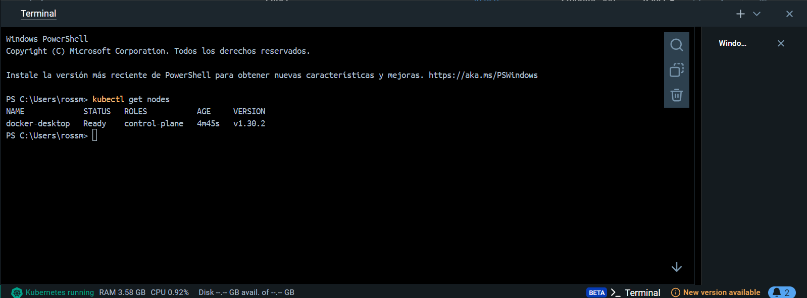

 Universidad de San Carlos de Guatemala 

 Facultad de Ingeniería 
 

 Escuela de Ciencias y Sistemas 

 Sistemas Operativos 1 

 Segundo Semestre 2024 

 Catedrático: Jesús Alberto Guzmán Polanco 

### Datos Personales:
Nombre                              | Carnet
----------------------------------- | -------------
Hesban Amilcar Argueta Aguilar      | 201704787

## Actividad 8 - Primeros pasos con K8s

1. Instalar un ambiente local de Kubernetes utlizando minikube, kind o Docker Desktop.

### Instalarar un entorno local con Docker Desktop

### Activar Kubernetes en Docker Desktop

Para activar kubernetes se realizan una serie de pasos que se presentan a continuación:

- Se hace clic en el icono de engraneje

- Se seleccina la opción kubernetes

- Marca la casilla Enable Kubernetes (Habilitar Kubernetes).

- Haz clic en Apply & Restart.

Docker Desktop instalará Kubernetes y lo iniciará automáticamente. Para verificar que el kubernetes esta corriendo, se abre una terminal y se coloca el comando `kubectl get nodes`

### Desplegar un contenedor de algun web server, apache o nginx por ejemplo, en el Cluster de K8s Local.

Para desplegar un contenedor web server en este caso elegimos nginx se realizó los sigueintes pasos:

- Ejecutar el siguiente comando para crear un deployment de NGINX:

- Para que el servidor NGINX sea accesible desde fuera del clúster, se debe de exponer el deployment:

El tipo de servicio LoadBalancer expone el servicio de manera externa, lo cual Docker Desktop maneja internamente.

- Docker Desktop asigna automáticamente una IP local al servicio. Para obtener la URL o puerto de acceso, usa el siguiente comando:

- Una vez se obtiene el puerto asignado, se accede al servidor NGINX desde el navegador:

- Luego como ultimo paso verificamos en docker desktop que el cluster y el deployment estan corriendo correctamente:

### Contestar a siguiente pregunta.¿En un ambiente local de Kubernetes existen los nodos masters y workers, como es que esto funciona?

En un ambiente local de Kubernetes, como en Docker Desktop, tanto los nodos master como worker están emulados en una única máquina. 

El nodo master gestiona el clúster, programando las aplicaciones y manteniendo el estado del sistema, mientras que los nodos worker ejecutan los contenedores. Todo ocurre en un entorno virtualizado.